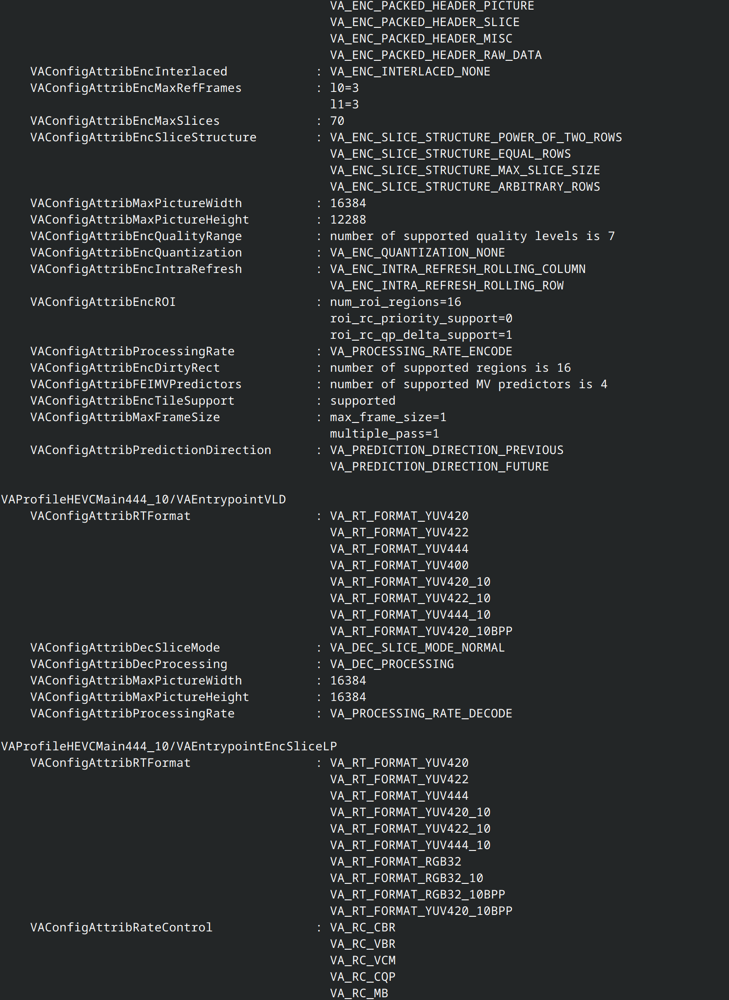

# Going Full Platform-Specific

> Nobody really needs anything else than 64-bit Linux.

<!--
At least until we get some proper consumer ARM hardware other
than those godawful "Copilot PCs"

Original "quote" was: This shit's gonna have Rust in it.
Allegedly Deadpool said that.
-->

---

## `$ whoami`

- __Alex Katlein__
- Freelancing software consultant
- Avatar of NIH
- Well rested after a month-long holiday

<!--
Spent most of my career doing consulting work, except one small exception where
I actual worked for the same company that paid my salary.
Nowadays I mainly do software architecture but I'm a coder at heart.
-->

> TODO: add vacation photo collage

---

### Tech

- Kotlin since 2015 (`M13`)
- Rust since 2018 (`1.26.0`)

<!--
Standout features:
  - Kotlin
    - lateinit keyword (basically it's you knowing more than the compiler)
    - current visibility rules (which are simple but sometimes not enough)
      (there's currently a huge debate about additional rules on YouTrack)
  - Rust
    - main can return Result (no more need to create a wrapper for your)
      (actual main function which just adds boilerplate)
    - nicer match bindings for Option (no more requirement to specify)
      (variants as references)
-->

---

### Work

- IoT for media streaming (🚄)
- Neobanking (until bankruptcy)
- Single point of failure for e-commerce
- Rearchitecting core insurance system

<!--
Just a small excerpt and overview:

- IoT
  - Basically treated trains like huge IoT devices
  - Had to contend with bad network infrastructure in Germany
  - Clever caching and batching required for monitoring data
- Neobanking
  - For gamers 🤪
  - Spent more time debugging external core banking system
    than anything else
- e-commerce
  - Team ran the reverse proxy for the entire platform
  - 1/2 hour of outage was a loss of 2 million EUR
- Core Insurance System
  - Project was sadly cancelled before we could really get started
  - Although we did get some major observability and deployment wins
-->

---

### Projects

- The Movie Database API client
- Jaffree Fork
- ez-dyndns-rs
- ...

<!--
Most of my project seem to stem from Media Server 47, which is
the reason for this talk. Kinda fits the pattern TBH.

Jaffree is an FFmpeg API for JVM (wraps the ffmpeg executable).
I forked it because of fundamental disagreements between original creator
and me. For example: I want to use standard Java concurrency APIs like
CompletionStage (which incidentally integrates nicely with other concurrency
libraries like Kotlinx Coroutines or rxJava) but the original creator wasn't
interested. Also he is managing all his process specific threads himself,
which I think is unnecessary with libraries like NuProcess.
Oh well, I will link to the project at the end of the presentation and you
can check for yourself.
-->

---

## Thanks

- APSA, the alltime sponsor of Kotlin Vienna
- Rainer
- Specific-Group Austria

> TODO: add SPG logo

---

## `$ ls -l`

- Media Server 47
- Constraints
- The Challenge
- Rust
- INTERMISSION
- Kotlin
- The Solution
- Code & Demo

---

## Media Server 47

- A streaming server
- Zeroconf where possible
- Testbed for things I want to try

<!--
I can't believe it's been ten years since I started working on something
like it xD
It just took me that long to finally learn YAGNI and focus, even though
I still sometimes fail at that.
The main objectives for my media server are first and foremost to learn
new stuff, to try new ways of structuring software, and also to test
exciting technologies in the confines of a proper project instead of creating
toy projects for problems that don't exist. And it fits nicely into my
NIH mindset.
I want it to adapt to the environment it runs on, instead of the user having
to adapt the environment to it. It should detect most settings on its own,
only requiring dynamic configuration by the user for critical stuff, e.g.
security.
For now the database and Valkey server are the only things a user would
have to specify using environment variables.
-->

---

### Jellyfin

- Fork of Emby when it went closed-source
- Very good transcoding capabilities
- _NOT_ zeroconf

<!--
Also, it's written for .NET using C# and ASP.NET, which I absolutely don'y
care about. But that's my idiological stance, which doesn't have to align
with others'.
It's transcoding capabilities however are excellent, they even maintain
their own FFmpeg port with their own patches (which take a while to upstream).
My media server is going to use their FFmpeg port, simply because it's proven
and feature-complete for such a scenario. So, shout out to Jellyfin!
However, hardware accelerated transcoding requires a bit of configuration, and
the client capabilities aren't reliably detected which can lead to playback
failures with unsupported media formats.
-->

<!-- TODO: add jellyfin screenshot, stylized -->

---

### Plex

- It's got everything: Local media, TV, Radio, etc...
- Not very customer friendly (not FOSS)
- Important features behind paywall

<!--
Plex has turned into a business. It used to be the one-stop shop for all
homestreamers' desires, but it has turned against them. Now it's just for
the normies who don't necessarily have the required technical acumen to
run a proper homelab (i.e. people who use Synology or QNAP "NAS" solutions).
The part where it's hostile comes from the fact that they require a user-
registration and login even when self-hosting.
And if you want to use your hardware for hardware accelerated transcoding
you need to pay a monthly fee, just for the privilege of utilizing your
own hardware to the fullest. (yuck)
-->

<!-- TODO: add plex promo art -->

---

### Others...

- Emby
- and a boatload of other proprietary solutions...

<!--
Don't want to spend too much time on stuff that doesn't matter,
like Emby (ever since they went closed-source) and other proprietary
software. Just know that it exists, I don't like it, and move on.
-->
---

## Constraints

- Homelab environment
  - Limited CPU capacity
  - Limited storage capacity
- (Persisted) pre-transcoding is not feasible

<!--
Most people aren't running a server farm in their basement or office.
Oftentimes it's just an older PC that has been repurposed into a
server and connected to the router to provide some limited services
like file storage or backups.

This requires a media server to transcode the media on demand if required.
The result must be tailored to the device the user is utilizing to access
the media content.
-->

---

### Consumer GPUs

- Nvidia (the best 😐)
- AMD (catching up 🫠)
- Intel (most common 🙃)

<!--
The reason I put that emoji there next to Nvidia is simple: Right now they
have a monopoly which they have used pricegouge their loyalest customers.
Luckily you don't need an RTX 5090 (only if you want to encode AV1), just
get yourself a previous generation midrange card (like the 3070) or even older
if you don't need to decode AV1.
AMD is sadly still catching up in terms of both performance and quality. AMD
transcoding results still look noticably worse than Nvidia results targeting
the same bitrate.
Intel on the other hand is the most common of the three, simply because they
include their transcoding hardware on basically every CPU they ship. This
of course requires you to use an Intel CPU which is not desirable at the moment.
The new AMD APUs look promising, but I haven't looked into those yet.
-->

<!-- TODO: add GPU vendor graphics -->

---

## The Challenge

- Autodetection of transcoding capabilities
- Graceful degradation

<!--
And this at last brings us to the big challenge and what this talk is actually
about: How to detect the transcoding capabilities of any hardware that may
be installed and available?
If we simply asked the user it would go against the zeroconf approach and the
they may not even be sure what the exact capabilities are or where to find
the information.
For example, Jellyfin requires us to configure the supported codecs and additional
features like tonemapping (they got defaults for that at least), but if a client
device doesn't support a codec, or the hardware doesn't support it, playback
just fails without gracefully degrading, e.g. using CPU to decode and using GPU
just for encoding or choosing a different codec.
-->

---

### Utilities

- Provided by driver (e.g. `nvidia-smi`)
- Or an extra package (e.g. `vainfo`)

<!--
For all APIs or drivers there is a utility that provides some information
in an accessible way. I say accessible because technically you can access
the provided information. It's just that some tools are more useful than
others, and also differ in the amount and quality and information they
each provide.
-->

---

#### `vainfo`

<!--
vainfo actually provides all the information you'd need to properly
detect hardware support. However, as you can see the output format is not
very machine readable and requires additional filtering to get the result
you want.
-->

---

#### `nvidia-smi`

- Only provides device information
  - List of GPUs
  - Usage details like GPU or memory utilization
- Requires LUT

<!--
nvidia-smi on the other hand is almost useless in that regard. As it
only provides device level information but nothing about the transcoding
capabilities it's only use is in providing the list of devices and their
names. This requires us to use a look up table which requires constant
maintenance and may not be as accurate as can be.
in the past I tried to create such a LUT, but it was a pure PITA and the
final painful experience that made me look into another way to get the
information I desired.
-->

---

## Rust

- Low-level language with high-level abstractions
- Mostly compile time memory management
- Almost seamless C interoperability

<!--
Before we get to the actual implementation I'll just spend some time
explaining some basic technologies so you'll be able to keep up, if you're
not familiar with Rust et al.
Rust is a low-level language with high-level abstractions. That means you
can write code that lives close to the hardware (in some cases even on hardware)
but can be written in such a way that it doesn't require an arcane understanding
of the underlying hardware. It has a pleasant, even if sometimes verbose, syntax
and most of its abstractions don't cost anything at runtime.
I'm pretty sure you've heard of the borrow checker before, and I won't spend
much time on it here, but it enables Rust to move most of the memory management
to the compilation time (which causes the long compilation times) and only
requires minimal memory management at runtime.
Thirdly, as an established programming language that wants to be taken serious
it has everything that's required to interop with C based APIs. Of course there's
still some work required but proper tooling makes it seamless.
-->

<!-- TODO: Add Rust logo -->

---

### C (the protocol)

- The only ABI humanity ever managed to agree on
- Used everywhere, by all languages
- That's how interpreted languages do stuff that needs to go fast

<!--
C is not just an ancient but powerful programming language. Over time it has
evolved into a protocol which everyone is implementing to provide access to
hardware or kernel resources otherwise unobtainable.
This is especially valuable in platforms like Python and NodeJS, where everything
that needs to go fast or requires deeper hardware access is implemented as a
native library that's accessed using a C compatible interface.
Usecases of that include all of machine learning, scientific math, and sometimes
even 3D rendering.
-->

---

### Dynamic library loading

- Keeps the final binary size low
- Ensures compatibility
- First level of hardware detection

<!--
For this project I wanted to load the required libraries manually instead of
linking them statically into the final library. This not only keeps the final
size of the binary down, it also ensures that it'll stay compatible with the
hardware for a long time. Who knows what those vendors will come up with in the
future which will require a new version of the library? Using dynamic loading
I can simply use the later versions of libraries without having to worry (much).
Also, it also kinda works as a first step to hardware detection: If a library
cannot be loaded it can be assumed that hardware of such vendors isn't available
and I needn't bother checking any further.
-->

---

### Gotchas

- Native C structs
  - Internal and external
- Memory management across context boundaries
- Differences in utilized C libraries

<!--
Using Rust to do such a thing like this and exposing that information via
a C API also has a few gotchas:

- Working with C structs and C libraries for the hardware stuff
- Exposing a C compatible API for the JVM
- How to deal with memory allocated in native code
- Different vendors expose their C APIs in different styles
-->

---

<!-- insert bollywood intermission text here -->

---

## Kotlin

<!-- full interop with the JVM ecosystem -->
<!-- need this for GraalVM -->
<!-- oh, and the Java Foreign Function and Memory Access API -->

---

### `jextract`

<!-- requires C header -->
<!-- produces base output -->

---

### Working with GraalVM

<!-- Use of a supporting framework advisable, e.g. Quarkus -->
<!-- Some static init gotchas, esp. for MethodHandle -->

---

### Alternatives

- JNI
- JNA
- UniFFI (by Mozilla)
- Kotlin/Native

<!--
- JNI
  - unsound memory model
  - clunky API
- JNA
  - prohibitively reflection heavy (not possible to get it work with GraalVM)
  - large runtime overhead
- UniFFI
  - already got an interface language: C
  - unsound resource management
- Kotlin/Native
  - don't want another garbage collector
  - when do I execute the GC?

Rust allows me to use the lingua franca of the OS, C, and brings a highly
optimized memory management model which lets me focus on the fun parts.
-->

---

## The Solution

<!-- let's ask the GPU vendor -->
<!-- and by that I mean we ask the native transcoding libraries -->

---

### VA-API

<!-- vaapi headers are easy to come by -->
<!-- well documented -->
<!-- have to enumerate the available device files yourself -->

---

#### CUVIDEC and NvEncode

<!-- two different styles of APIs (one C based, the other C++) -->
<!-- cuda headers not included by default, and licensed differently -->
<!-- powerful API, explain floating CUDA contexts -->

---

### Where's AMD?

<!-- actually covered by VAAPI -->
<!-- powerful opensource driver included in Linux kernel -->
<!-- mention inferior proprietary driver (only for specific use cases) -->

---

### Generating Rust bindings

<!-- mention required filtering of functions and structs -->
<!-- explain a bit about macros to handle calling and error handling -->

---

## Code

<!-- TODO: lead through code -->
<!-- start with going through the project structure -->
<!-- then the Rust code, choose one or two functions as examples -->
<!-- go through JVM bindings, jextract output, own workarounds -->
<!-- go through mapping to JVM types -->
<!-- explain final GraalVM build using Quarkus -->

---

## Demo

<!-- show off locally, via SSH on BEAST, and via SSH on SteamDeck -->
<!-- TODO: prepare video in advance in case something goes tits-up during the demo -->

---

## Takeaways

- The JVM is a powerful platform
- Now with powerful friends!
- Think outside the box!

---

## Links

[enc-dec-hwscan @ GitHub](https://github.com/v47-io/enc-dec-hwscan)
<!-- links to project on github -->
<!-- links to helpful resources (one or two) -->

<!-- link to original Jaffree and my own Jaffree -->